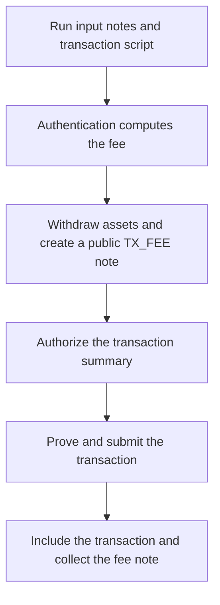

# Transaction Fees

Miden transaction fees pay for verification and batch inclusion. The executing account pays from its vault by creating a public `TX_FEE` output note during authentication. The batch builder can collect that note when it includes the transaction.

- The current clients pay in the network's native fee asset, identified by `fee_faucet_id` in the reference block.
- The amount depends on the reference block's base fee and the logarithm of the transaction's estimated VM cycle count.
- A new account can fund its first transaction by consuming a note containing the fee asset.
- Payment takes effect when the transaction is included and its fee note becomes available onchain.

Local execution and proving use the client's resources. Charges from a delegated proving service, if any, are separate from the protocol transaction fee.

## Paying your first fee

For a standard single-signature account, the client prepares native fee payment automatically. The account must retain enough of the native fee asset to cover the fee after any transfers of that asset.

Creating a faucet for your own token does not supply native fee funds. The faucet pays when it mints, the sender pays when it sends, and the recipient pays when it consumes the resulting note. Each of those transactions needs its own funding.

To fund an empty account on a development network:

1. Request a note containing the native fee asset from that network's faucet. Check that the issuing faucet matches the reference block's `fee_faucet_id`.
2. Synchronize the client until the funding note and its inclusion proof are available.
3. Consume the funding note. Its script deposits the asset before authentication withdraws the fee, leaving the remainder in the account vault.
4. Wait for confirmation and synchronize before using the remaining balance.

A standard P2ID funding note calls `BasicWallet::receive_asset`. A custom account must expose that interface, or use a funding note compatible with its own receiving procedure. The incoming amount must cover the first consume's fee as well as the balance you want to keep.

### Native payment with the Rust client

This fragment uses `miden-client` `0.16.0`. It assumes an initialized `client`, a locally tracked single-signature `account_id` with its signer available, and a committed `funding_note` of type `Note` containing sufficient native fee funds. The account must be able to receive the note's assets.

```rust
use miden_client::transaction::TransactionRequestBuilder;

let request = TransactionRequestBuilder::new()
    .build_consume_notes(vec![funding_note])?;

let tx_id = client.submit_new_transaction(account_id, request).await?;
```

On a network with a nonzero verification base fee, the client adds the native `1/1` fee-conversion commitment during request preparation. Submission returns a transaction ID; use it to track confirmation before continuing. See [Transactions](../../tools/clients/web-client/transactions.md) for the Web SDK's send, mint, consume, and confirmation APIs.

## How the fee is calculated

The transaction's reference block supplies a `verification_base_fee`, expressed in base units of the network's native fee asset. During authentication, `compute_fee` combines the cycles already executed with an estimate of the remaining work, including signature verification, fee payment, and the kernel epilogue.

For a positive estimated total of $C$ cycles and a verification base fee of $B$, the fee in native base units is:

$$
F_{\mathrm{native}} = B \times \left(\left\lfloor \log_2 C \right\rfloor + 1\right)
$$

The current output-note component of the protocol fee is zero, so only the verification term contributes. Within one cycle range, additional computation leaves the fee unchanged. Crossing a power-of-two boundary increases the multiplier by one, including when the estimate is exactly that power of two.

For an illustrative base fee of `500`:

| Estimated total cycles | Multiplier | Fee in native base units |
| --- | --- | --- |
| 32,768 to 65,535 | 16 | 8,000 |
| 65,536 to 131,071 | 17 | 8,500 |
| 131,072 to 262,143 | 18 | 9,000 |

A `90,000`-cycle estimate therefore costs `500 × 17 = 8,500` native base units. These are arithmetic examples, not live network prices or measured costs for a particular operation. Read the base fee from the transaction's reference block.

:::info Why the remaining work is estimated
Authentication runs before the transaction has finished. Standard authentication components add cycle margins for their signature scheme and the remaining kernel work. The resulting estimate can differ from the final measured execution trace; the fee changes only if the estimate crosses a tier boundary.
:::

## Inspecting a transaction's fee

With Web SDK `0.16.0`, the manual transaction lifecycle exposes the fee note after local execution and before proving or submission. This fragment assumes an initialized `client`, a tracked `account` with sufficient native funding and an available signer, and a prepared `request`:

```typescript
const execution = await client.transactions.executeRequest(account, request);
const feeNote = execution.result.executedTransaction().feeNote();

if (feeNote) {
  const asset = feeNote.assets()?.fungibleAssets()[0];
  if (!asset) throw new Error("Expected a native fee asset");
  console.log("Fee asset:", asset.faucetId().toString());
  console.log("Fee in base units:", asset.amount().toString());
} else {
  console.log("This transaction has no protocol fee note");
}
```

This reads the payment produced by that execution. It does not prove, submit, or apply the transaction. Continue with the same execution artifact if you want to submit it; executing a new request against a different reference block or state can produce a different fee.

:::note Execution can request a signature
`executeRequest` runs authentication. It requires the account state and the authorization needed to complete execution. The SDK's `preview` supports transactions awaiting authorization, such as multisig proposals; it is not a general signature-free fee estimator for single-signature accounts. A numerical quote from the formula above also needs a cycle estimate and does not execute the request.
:::

## How payment works



The standard `AuthSingleSig` and `AuthMultisig` components perform these steps during authentication:

1. Load the payment asset and conversion rate committed through the transaction's authentication arguments. The current client prepares the native asset at `1/1`.
2. Calculate the protocol fee from the reference block's base fee and the estimated cycle count.
3. Round the converted payment amount up and withdraw it from the account vault.
4. Create a public `TX_FEE` note containing the payment.
5. Authorize the transaction summary, which commits to both the vault withdrawal and the fee note.

The fee note is always public, uses the `0xFEE` tag, and has no target account. Its assets and amounts are public even when the application's notes are private. Any account with the basic wallet interface can consume it, allowing the batch builder to claim the payment. When processing output notes, use the SDK's fee-note accessor or identify the standard script; a tag alone does not establish that a note is a protocol fee payment.

## Choosing a payment asset

The current Rust and Web clients prepare payment in the network's native fee asset at `1/1`. Use that path for ordinary transactions.

At the protocol level, fee conversion supports a payment in another fungible asset:

$$
P_{\mathrm{asset}} = \left\lceil F_{\mathrm{native}} \times
\frac{r_{\mathrm{num}}}{r_{\mathrm{den}}} \right\rceil
$$

Both rate components must be nonzero field elements. For signature-based authentication, the signer commits to the selected asset's faucet ID, the conversion rate, and a salt through the authentication arguments. These cannot change after authorization. The client uses a fixed default salt for standard single-signature accounts so their summaries remain reproducible; multisig accounts require a caller-chosen salt for replay protection when paying a nonzero protocol fee.

The protocol validates the commitment and conversion arithmetic; it does not determine a market price. Alternative-asset payment needs a compatible integration and an asset and rate accepted by the intended batch builder. Protocol support does not imply that a deployed builder accepts your token. The current client's native-payment builder does not select alternative assets.

### Multisig and custom authentication

Standard `AuthMultisig` only accepts the native fee asset and caps the payment at twice the computed native fee. The protocol's alternative-asset conversion support does not override that restriction.

For a manually built multisig request, declare a fresh fee-conversion salt with Rust's `fee_conversion_salt(salt)`, or obtain a Web SDK builder with `await client.feeAwareTransactionRequestBuilder(account)`. Keep the request, salt, and reference-block anchor unchanged while collecting signatures for that proposal. Choose a new salt for a new proposal. The Web SDK's operations that build their own requests prepare the salt when needed.

An explicit authentication argument makes the caller responsible for its contents. Custom authentication that reads conversion information must supply the matching commitment and advice data and invoke fee payment. Standard no-auth and network-account authentication pay natively without a caller-supplied conversion commitment. See [Authentication](../accounts/authentication.md#writing-a-custom-auth-component).

## Zero-fee networks and failed transactions

If the reference block's `verification_base_fee` is zero, standard authentication creates no `TX_FEE` note. Check the network's parameters rather than assuming that a development network has fees disabled.

If a transaction fails locally during execution, fee payment, authentication, or proving, its output notes never become live and it transfers no onchain protocol fee. Local execution and proving can still consume resources.

<details>
<summary>Fee withdrawal fails</summary>

The executing account needs enough of the native fee asset in its vault or incoming notes. A balance of the tutorial's token is insufficient.

</details>

<details>
<summary>The first P2ID funding note fails</summary>

The account needs a compatible receiving interface and enough incoming funds to pay the consume's fee.

</details>

<details>
<summary>A manual multisig request reports FeeConversionInfoRequired</summary>

Declare a fresh fee-conversion salt for the proposal.

</details>

<details>
<summary>Custom authentication cannot read fee conversion data</summary>

Supply its expected commitment and advice data, and call the fee-payment procedure.

</details>

<details>
<summary>The builder rejects the payment asset or rate</summary>

Use an asset and rate supported by that builder. A transaction that is never included transfers no fee.

</details>

<details>
<summary>Submission or confirmation times out</summary>

Check the transaction ID's status. A timeout does not establish whether the transaction was included or its fee paid.

</details>

## Network-account fees

Network transactions introduce a second, separate fee. The network account pays the protocol transaction fee from its own vault, while its application fee policy prices each note that the network consumes on its behalf.

| Fee | What it pays for | Who funds it | Payment mechanism |
|---|---|---|---|
| **Protocol transaction fee** | Verification and batch inclusion | The executing network account | Public `TX_FEE` note |
| **Network-account application fee** | The account's service and its protocol-fee cost | The sender of the targeted note, or an upstream network account | `FEE_SPONSORSHIP` note |

A sponsorship note names the application note it funds. Its script requires that application note to be consumed in the same transaction; a separately configured reclaim path can return unused sponsorship funds. The network account's authentication procedure checks that each application note's fee is covered and collects the sponsorship assets into its vault before paying the protocol fee.

During the sending transaction's standard authentication, each network output note is priced through the target account's fee policy. A nonzero application fee automatically creates a matching sponsorship note funded from the sender's vault; a zero application fee creates none. This automatic sponsorship uses the native fee asset and requires the target's nonzero fee to use that asset too.

Setting an application fee to zero does not fund the network account's protocol fee. Conversely, a zero `verification_base_fee` does not necessarily make the application fee zero. That price comes from the network account's own policy. See [Network Accounts](../accounts/network-accounts.md) for configuration and sponsorship behavior.

## Related

- [Protocol fee implementation](https://github.com/0xMiden/protocol/blob/v0.16.0/crates/miden-protocol/asm/kernels/transaction-core/src/tx.masm): kernel-level fee calculation
- [Authentication](../accounts/authentication.md): fee payment in standard and custom auth procedures
- [Network Accounts](../accounts/network-accounts.md): application fee policies and sponsorship
- [What are Transactions?](./introduction.md): execution, proving, submission, and failure behavior

:::info Source Reference
Protocol: [`compute_fee`](https://github.com/0xMiden/protocol/blob/v0.16.0/crates/miden-protocol/asm/kernels/transaction-core/src/tx.masm), [`FeeConversionInfo`](https://github.com/0xMiden/protocol/blob/v0.16.0/crates/miden-standards/src/account/auth/fee.rs), [`TxFeeNote`](https://github.com/0xMiden/protocol/blob/v0.16.0/crates/miden-standards/src/note/tx_fee.rs).

Clients: [Rust request preparation](https://github.com/0xMiden/rust-sdk/blob/v0.16.0/crates/rust-client/src/transaction/mod.rs), [Web SDK transaction lifecycle](https://github.com/0xMiden/web-sdk/blob/v0.16.0/crates/web-client/js/types/api-types.d.ts).
:::
