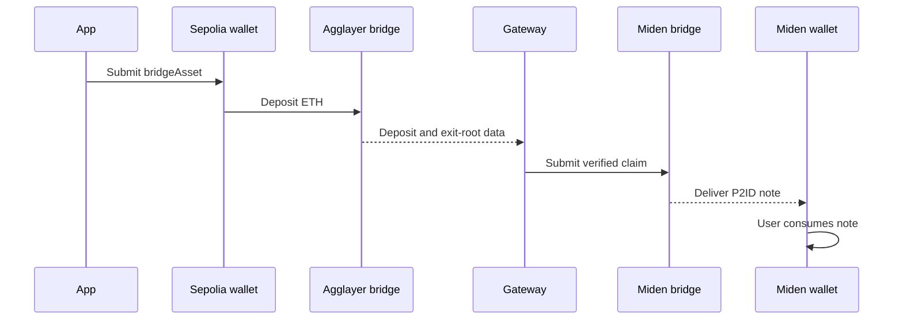
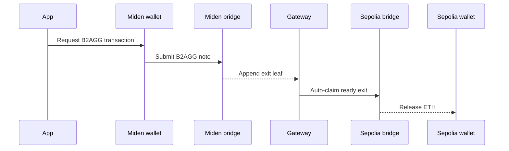

# Integrate Agglayer

The Agglayer integration gives a Miden application direct access to canonical
bridge semantics. The application builds the source-chain action, persists the
bridge identifiers, and follows the deposit until its destination transaction
settles.

The current reference integration supports:

| Direction        | Source asset       | Destination asset | Typical testnet time |
| ---------------- | ------------------ | ----------------- | -------------------- |
| Sepolia → Miden  | Native Sepolia ETH | Miden ETH         | 10–20 minutes        |
| Miden → Sepolia  | Miden ETH          | Sepolia ETH       | 10–20 minutes        |

These timings are not guarantees. They include source finality, Gateway
observation, exit-root and proof propagation, destination delivery, and—when
receiving on Miden—wallet note synchronization.

## Dependencies

```bash
npm install @miden-sdk/miden-sdk \
  @miden-sdk/miden-wallet-adapter-base \
  @miden-sdk/miden-wallet-adapter-react \
  viem
```

Use mutually compatible Miden SDK and wallet-adapter versions. The reference
implementation is currently verified with `@miden-sdk/miden-sdk@0.15.7`,
`@miden-sdk/miden-wallet-adapter-base@0.15.1`, and
`@miden-sdk/miden-wallet-adapter-react@0.15.1`.

## Current testnet parameters

Keep deployment parameters in one application configuration object. Recheck
them before a funded testnet run; rollup IDs and account deployments can change.

```typescript
export const AGGLAYER_BALI = {
  sepoliaChainId: 11155111,
  sepoliaBridgeAddress: "0x1348947e282138d8f377b467f7d9c2eb0f335d1f",
  midenNetworkId: 78,
  evmNetworkId: 0,
  nativeTokenAddress: "0x0000000000000000000000000000000000000000",
  midenBridgeId: "0xa22ec154f9a36d911953fd5c9260a7",
  midenEthFaucetId: "0x387149ae66116cf114eebd60bb7381",
  bridgeServiceApi:
    "https://miden-testnet-bridge.dev.eu-north-3.gateway.fm/api",
} as const;
```

## Sepolia → Miden



### 1. Encode the Miden destination

Agglayer represents the Miden account inside a 20-byte EVM address. Start from
the 30-hex-character Miden account ID:

```typescript
export function midenAccountToBridgeDestination(accountId: string) {
  const normalized = accountId.trim().replace(/^0x/, "");
  if (!/^[0-9a-fA-F]{30}$/.test(normalized)) {
    throw new Error("Expected a 15-byte Miden account ID.");
  }

  return `0x00000000${normalized.toLowerCase()}00` as `0x${string}`;
}
```

If the wallet returns a bech32 address, convert it to an `AccountId` with the
Miden SDK first. Do not accept an arbitrary EVM address as a Miden account: the
mapping is constrained and only the embedded format decodes successfully.

### 2. Build `bridgeAsset`

```typescript
import { encodeFunctionData, parseEther, toHex } from "viem";

const bridgeAssetAbi = [
  {
    type: "function",
    name: "bridgeAsset",
    stateMutability: "payable",
    inputs: [
      { name: "destinationNetwork", type: "uint32" },
      { name: "destinationAddress", type: "address" },
      { name: "amount", type: "uint256" },
      { name: "token", type: "address" },
      { name: "forceUpdateGlobalExitRoot", type: "bool" },
      { name: "permitData", type: "bytes" },
    ],
    outputs: [],
  },
] as const;

export function buildBridgeInTransaction(
  amountEth: string,
  midenAccountId: string,
) {
  const amount = parseEther(amountEth);
  const destinationAddress =
    midenAccountToBridgeDestination(midenAccountId);

  return {
    to: AGGLAYER_BALI.sepoliaBridgeAddress,
    data: encodeFunctionData({
      abi: bridgeAssetAbi,
      functionName: "bridgeAsset",
      args: [
        AGGLAYER_BALI.midenNetworkId,
        destinationAddress,
        amount,
        AGGLAYER_BALI.nativeTokenAddress,
        true,
        "0x",
      ],
    }),
    value: toHex(amount),
    gas: toHex(BigInt(300000)),
    destinationAddress,
  };
}
```

Submit the returned transaction through the connected Sepolia wallet. Persist
both the source transaction hash and `destinationAddress`; the embedded
destination is the key used to query deposits.

### 3. Track destination delivery

```typescript
export async function fetchAgglayerDeposits(destinationAddress: string) {
  const response = await fetch(
    `${AGGLAYER_BALI.bridgeServiceApi}/bridges/${destinationAddress}?limit=10&offset=0`,
    { cache: "no-store" },
  );

  if (!response.ok) {
    throw new Error(`Agglayer bridge status ${response.status}`);
  }

  return (await response.json()).deposits;
}
```

Match the row by the source transaction hash instead of assuming the newest
deposit belongs to the current transfer. When `claim_tx_hash` appears, the
Gateway service has created the destination note on Miden.

That bridge claim does **not** make the asset immediately spendable. Prompt the
Miden wallet to sync, show the delivered note, and let the recipient consume it.

## Miden → Sepolia



### 1. Create the `B2AGG` note

```typescript
import {
  AccountId,
  AssetCallbackFlag,
  EthAddress,
  FungibleAsset,
  Note,
  NoteArray,
  NoteAssets,
  TransactionRequestBuilder,
} from "@miden-sdk/miden-sdk";
import { Transaction } from "@miden-sdk/miden-wallet-adapter-base";

export async function createAgglayerBridgeOut({
  amount,
  destinationAddress,
  senderAddress,
  requestTransaction,
  waitForTransaction,
}: {
  amount: bigint;
  destinationAddress: string;
  senderAddress: string;
  requestTransaction: (transaction: Transaction) => Promise<string>;
  waitForTransaction: (requestId: string) => Promise<{ txHash: string }>;
}) {
  const sender = AccountId.fromBech32(senderAddress);
  const bridge = AccountId.fromHex(AGGLAYER_BALI.midenBridgeId);
  const faucet = AccountId.fromHex(AGGLAYER_BALI.midenEthFaucetId);

  const asset = new FungibleAsset(faucet, amount).withCallbacks(
    AssetCallbackFlag.Enabled,
  );
  const note = Note.createB2AggNote(
    sender,
    bridge,
    new NoteAssets([asset]),
    AGGLAYER_BALI.evmNetworkId,
    EthAddress.fromHex(destinationAddress),
  );
  const request = new TransactionRequestBuilder()
    .withOwnOutputNotes(new NoteArray([note]))
    .build();
  const transaction = Transaction.createCustomTransaction(
    senderAddress,
    senderAddress,
    request,
  );

  const requestId = await requestTransaction(transaction);
  const output = await waitForTransaction(requestId);
  return output.txHash;
}
```

The callback flag is required. Constructing the asset without
`AssetCallbackFlag.Enabled` changes its commitment and the bridge transaction
cannot remove the callback-enabled asset held by the wallet.

The wallet adapter initially returns a request UUID. Wait for settlement and
persist `output.txHash`; a request UUID is not a Midenscan transaction hash.

### 2. Track the auto-claim

Query the bridge indexer with the Sepolia destination address and match a row
whose origin is Miden network `78` and destination is EVM network `0`. A
populated `claim_tx_hash` means Gateway auto-claimed the exit on Sepolia.

Do not build a manual `claimAsset(...)` button for the current reference flow.

## State and recovery

Store at least:

- direction;
- source transaction hash;
- source and destination network IDs;
- embedded Miden destination or Sepolia recipient;
- bridge deposit count when available;
- destination claim transaction hash.

Render source settlement, bridge observation, destination settlement, and
Miden note consumption as separate states. A single `complete` boolean cannot
represent the recovery steps a user may still need.

## Trust boundary

The onchain Miden bridge verifies Global Exit Roots and Merkle proofs and
prevents duplicate claims. An offchain integration service still observes the
Agglayer state and creates the Miden update and claim notes. Your application
should expose that service dependency and testnet status.

## Reference implementation

- [Agglayer helpers in the bridge portal](https://github.com/0xMiden/bridge-portal/tree/main/src/app/lib)
- [Miden Agglayer protocol specification](https://github.com/0xMiden/protocol/blob/next/crates/miden-agglayer/SPEC.md)
- [Gateway bridge monitor](https://gateway-fm.github.io/miden-agglayer/bridge-monitor/bali/)
